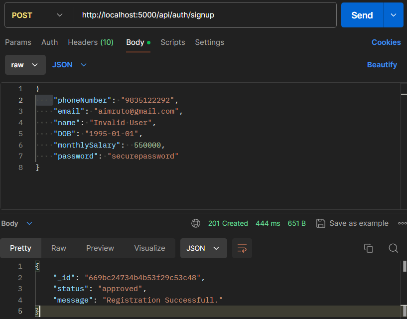
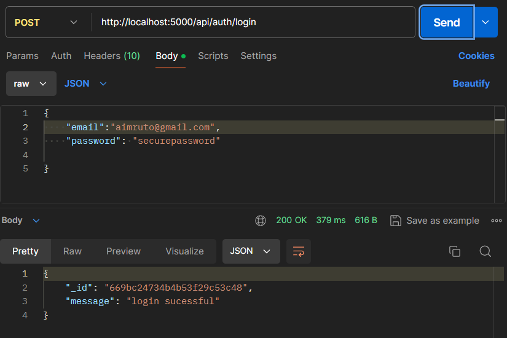
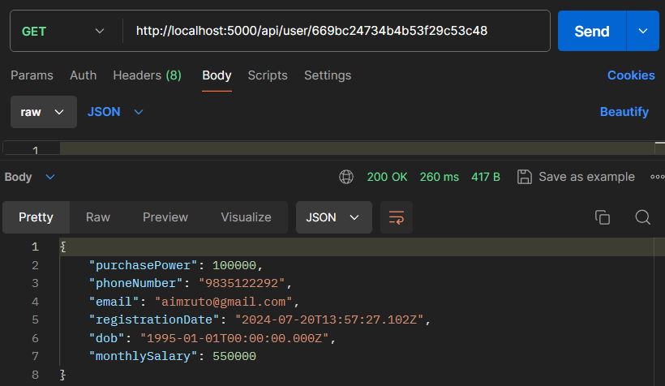
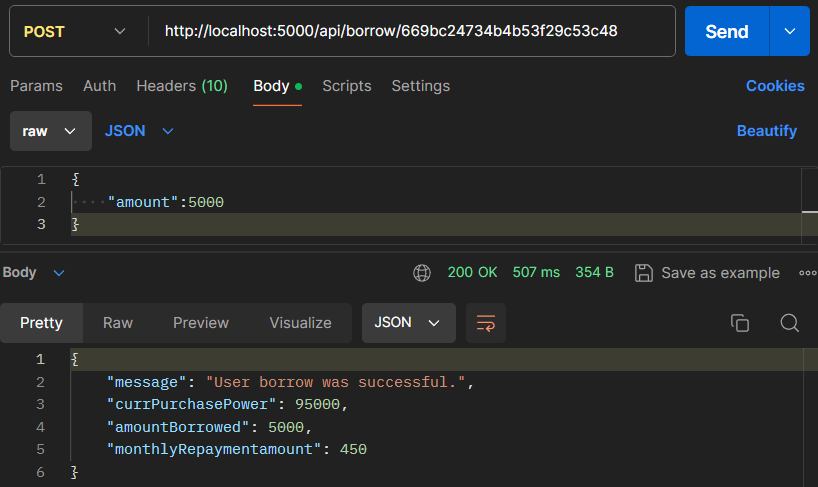
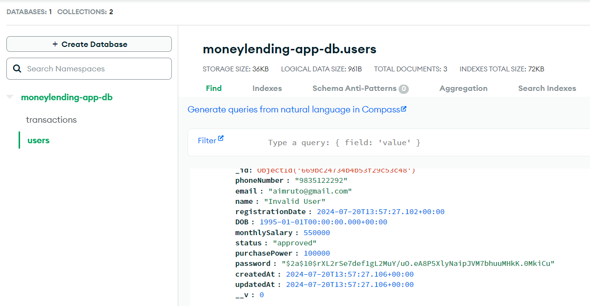
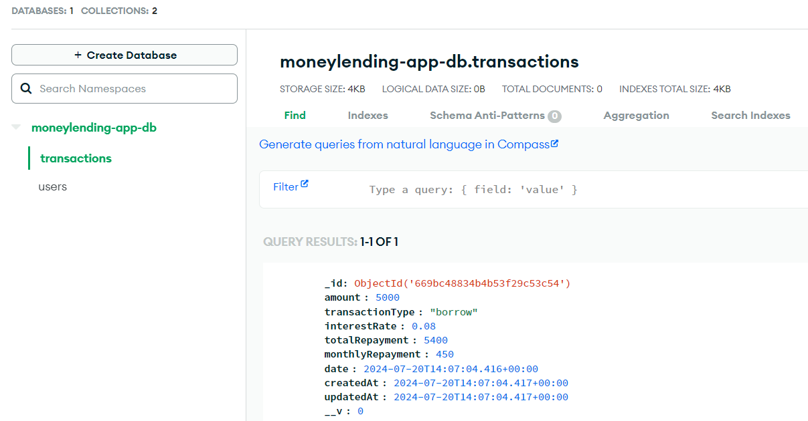

# Money Lending Application Backend

## Description
This is the backend for the Money Lending Application. It provides APIs for user registration, login, fetching user data and borrowing money.

## Features
- User registration with validation for age and monthly salary
- User login with JWT-based authentication
- Display authenticated user data
- Borrow money with purchase power calculation
- Protected routes with JWT authentication middleware

## Technologies Used
- Node.js
- Express.js
- MongoDB
- Mongoose
- JWT (JSON Web Token)
- bcrypt.js
- dotenv

## API Endpoints

### Auth Routes

- `POST /api/auth/signup`

    - Description: Register a new user
    - Request Body:
        ```json
        {
            "phoneNumber": "string",
            "email": "string",
            "name": "string",
            "DOB": "date",
            "monthlySalary": "number",
            "password": "string"
        }
        ```
    - Response:
        ```json
        {
            "status": "current_status",
            "message": "Registration successful"
        }
        ```

- `POST /api/auth/login`

    - Description: Login an existing user
    - Request Body:
        ```json
        {
            "email": "string",
            "password": "string"
        }
        ```
    - Response:
        ```json
        {
            "message": "Login successful"
        }
        ```

### User Routes

- `GET /api/user/:id`

    - Description: Fetch user data
    - Protected Route: Requires JWT
    - Response:
        ```json
        {
            "user data"
        }
        ```

### Borrow Routes

- `POST /api/borrow/:id`
    - Description: Borrow money
    - Protected Route: Requires JWT
    - Request Body:
        ```json
        {
            "amount": "number"
        }
        ```
    - Response:
        ```json
        {
            "message": "User borrow was successful",
            "currPurchasePower": "number",
            "amountBorrowed": "number",
            "monthlyRepaymentamount": "number"
        }
        ```

### Postman Screenshots

1. **Signup Endpoint**
   - Screenshot showing the request configuration for user signup.
     

2. **Login Endpoint**
   - Screenshot showing the request configuration for user login.
     

3. **User Data Endpoint**
   - Screenshot showing the request configuration for fetching user data.
     

4. **Borrow Money Endpoint**
   - Screenshot showing the request configuration for borrowing money.
     

**MongoDB Screenshots**
1. **users collection**

   

2. **transactions collection**

   
   
## Getting Started

### Prerequisites
- npm (Node Package Manager)
- Node.js
- MongoDB

### Installation

1. Clone the repository:

    ```bash
    git clone https://github.com/Aimruto/moneylending-app.git
    ```

2. Change into the project directory:

    ```bash
    cd moneylending-app
    ```

3. Install the dependencies:

    ```bash
    npm install
    ```

4. Create a `.env` file in the root directory and add the following environment variables:

    ```
    PORT=8000
    MONGO_URI=your_mongodb_connection_string
    JWT_SECRET=your_jwt_secret
    NODE_ENV=development
    ```

## Running the Application

#### Using Node.js Directly:

1. Start the server:
    ```bash
    npm run server
    ```

2. The server will start on `http://localhost:8000`.

#### Using Docker:

1. Build the Docker image:
    ```bash
    docker build -t moneylendingapp:latest .
    ```

2. Run the Docker container:
    ```bash
    docker run --env-file .env -p 5000:5000 moneylendingapp:latest
    ```

3. The server will start on `http://localhost:5000`.

### Pushing to Docker Hub

1. **Login to Docker Hub:**

    ```bash
    docker login
    ```

    Follow the prompts to enter your Docker Hub username and password.

2. **Tag the Docker image:**

    ```bash
    docker tag moneylendingapp:latest your_dockerhub_username/moneylendingapp:latest
    ```

    Replace `your_dockerhub_username` with your Docker Hub username.

3. **Push the Docker image to Docker Hub:**

    ```bash
    docker push your_dockerhub_username/moneylendingapp:latest
    ```

4. **Verify the Docker image is available on Docker Hub:**

    Visit [Docker Hub](https://hub.docker.com/) and check your repository to see if the image has been uploaded successfully.

